# Bank Loan Risk Analytics

An end-to-end credit risk analytics pipeline covering exploratory data analysis, feature engineering, risk classification modeling, and an interactive Power BI dashboard for loan approval decision support.

## Overview

This project simulates a real-world bank risk assessment system: analyzing loan applicant data, engineering risk indicators, predicting default risk, and visualizing key risk metrics for underwriting decisions.

## Tech Stack

- **Python** — data cleaning, EDA, feature engineering, ML models
- **SQL (MySQL)** — data querying and business logic
- **Power BI** — interactive dashboard and DAX measures
- **Machine Learning** — Logistic Regression, Random Forest classification

## Pipeline

1. Data cleaning & EDA
2. Feature engineering (RiskCategory, LoanToIncomeRatio, AssetToLiabilityRatio)
3. MySQL database with business SQL queries
4. Logistic Regression model (98.93% accuracy)
5. Random Forest model (98.03% accuracy)
6. Power BI dashboard (5 pages)

## Key Insights

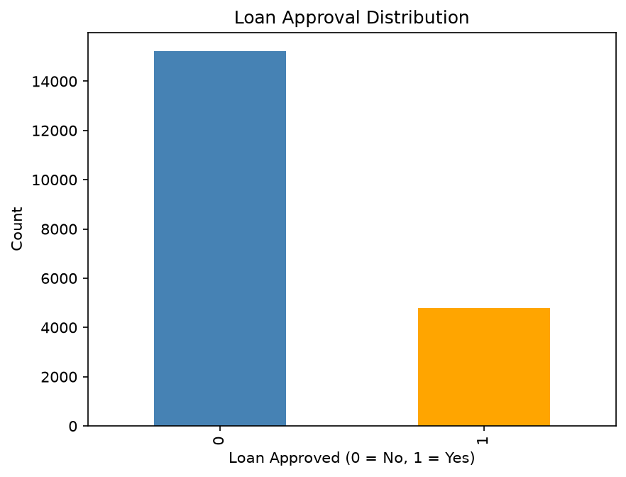

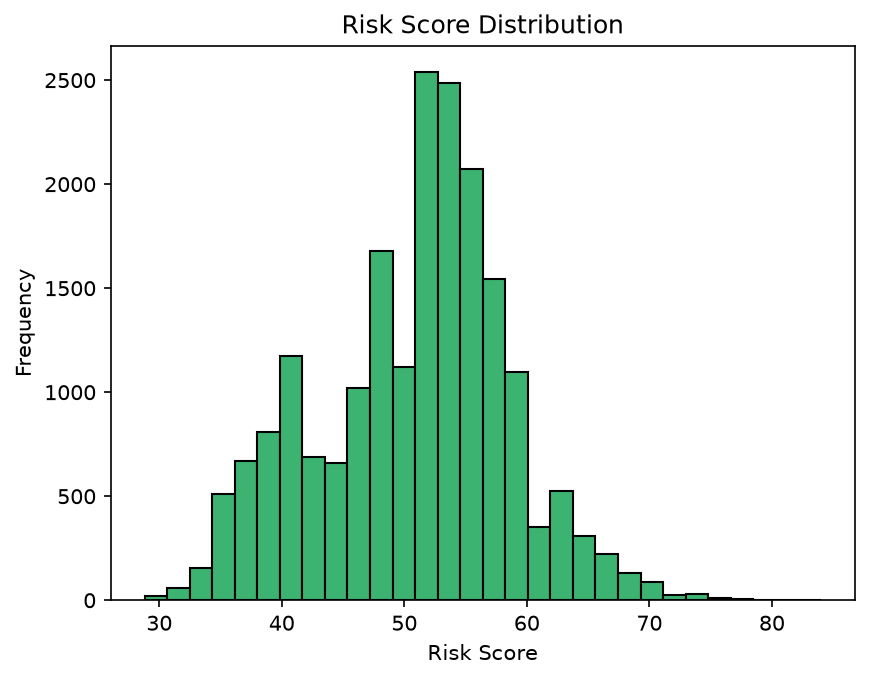

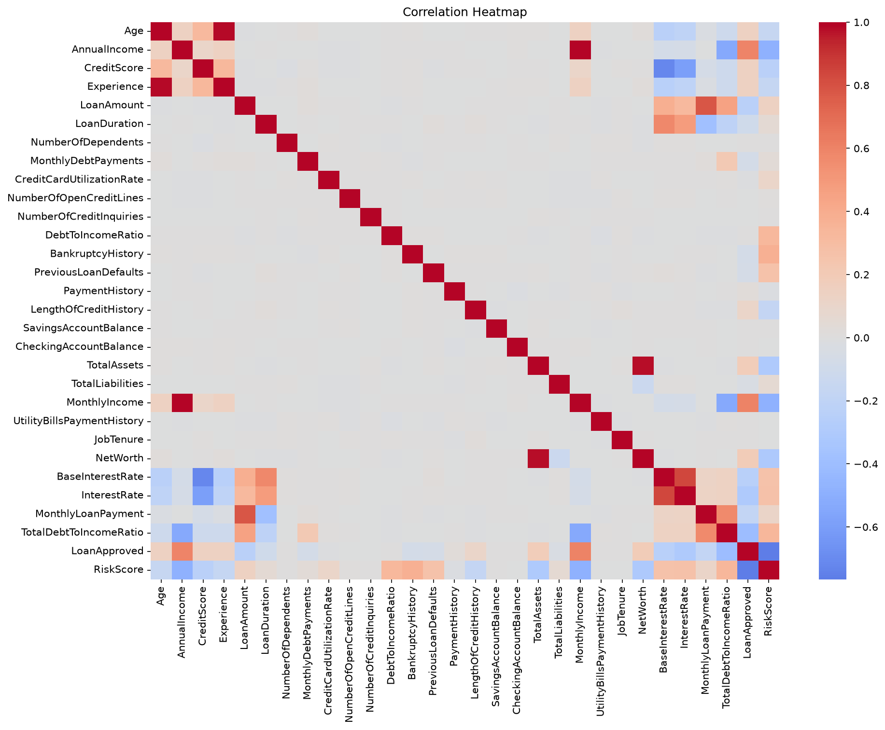

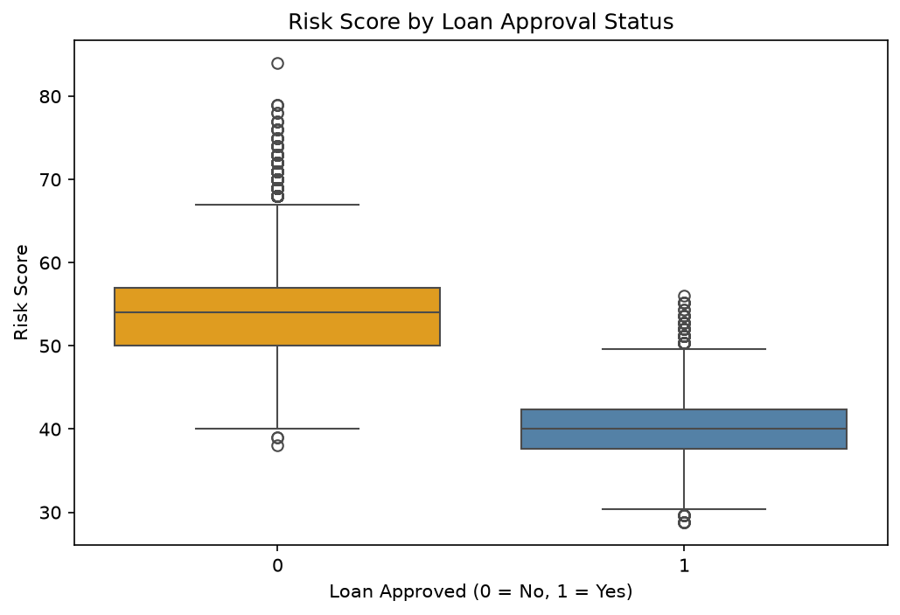

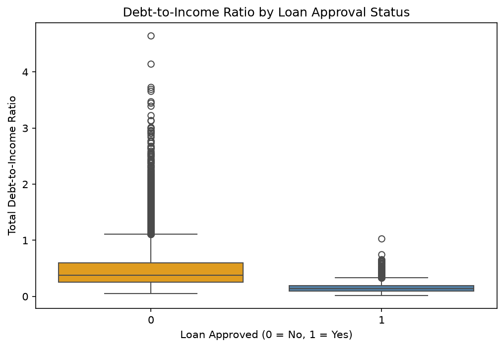

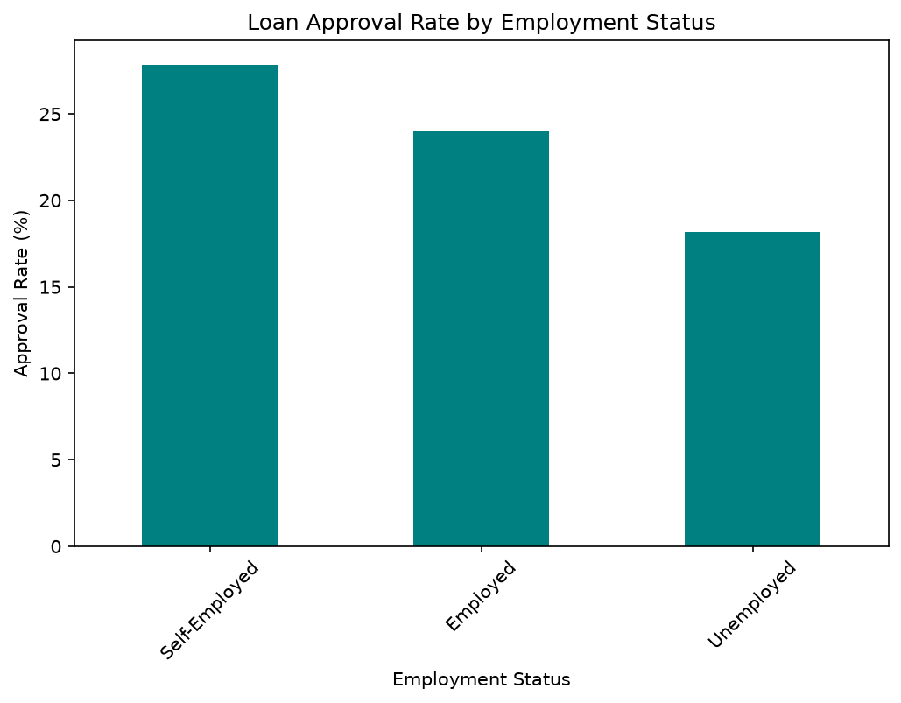

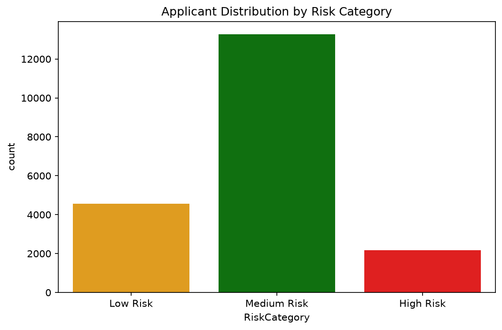

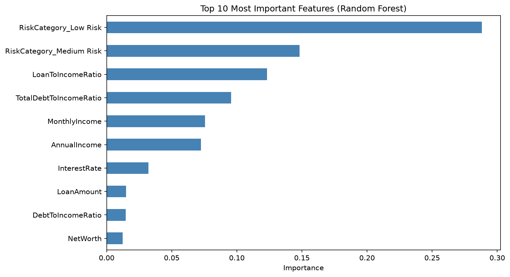

## Dashboard Preview

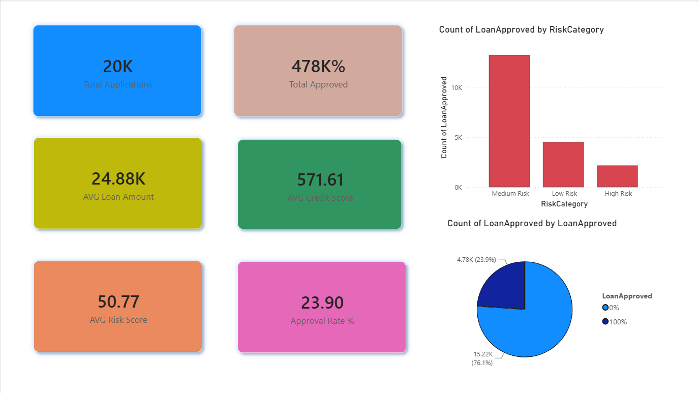

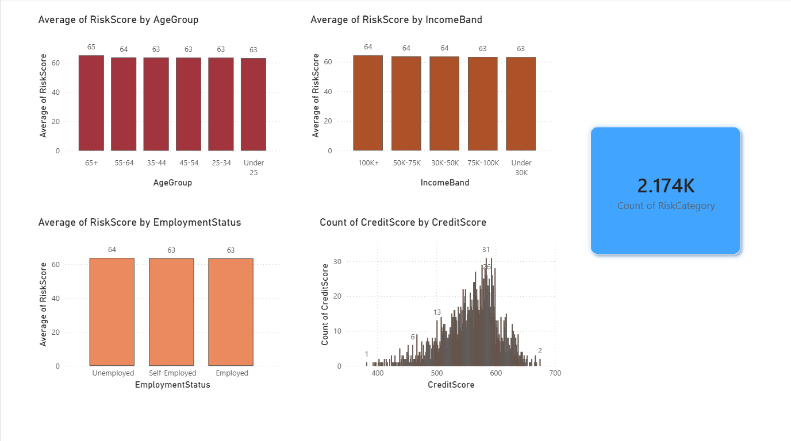

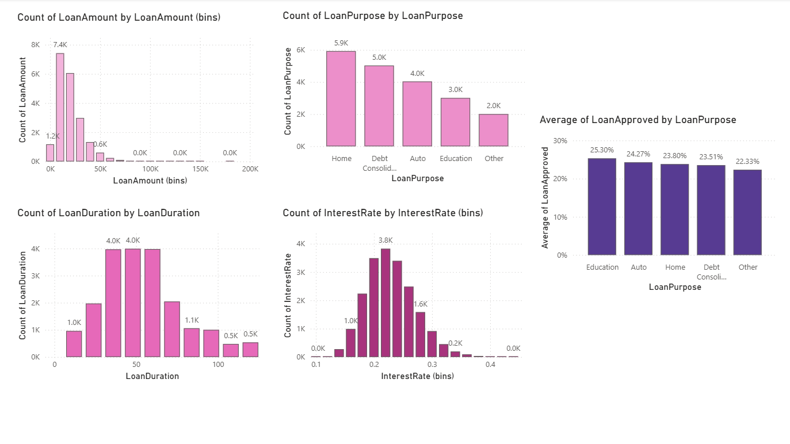

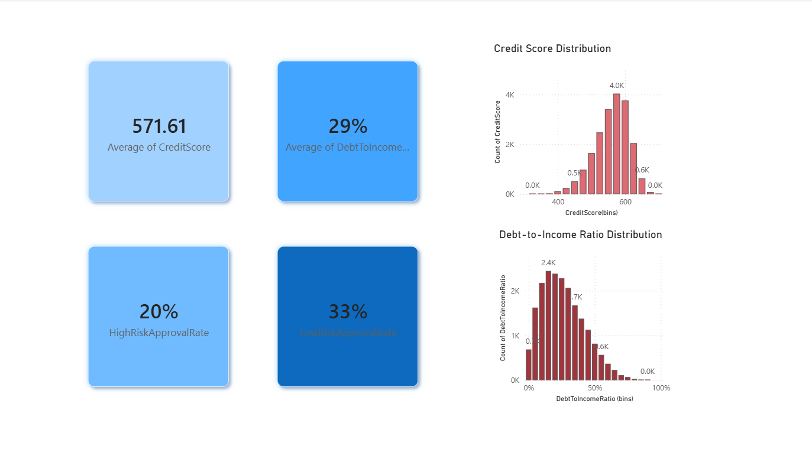

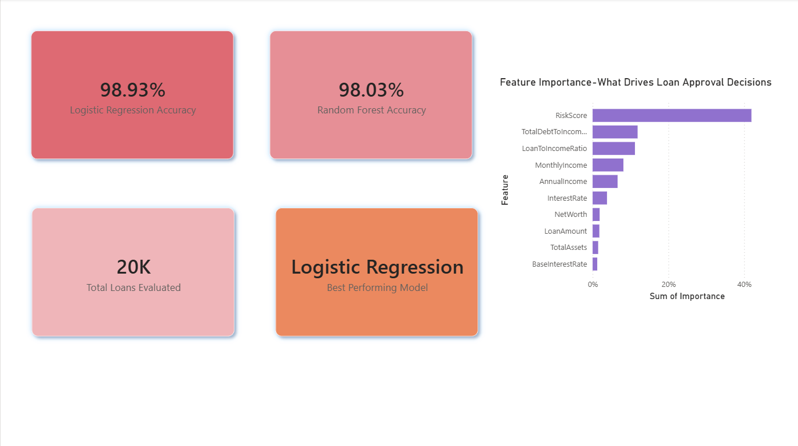

## Author

Subham Pattnaik
[LinkedIn](https://linkedin.com/in/subham-pattnaik-0738bb324)
